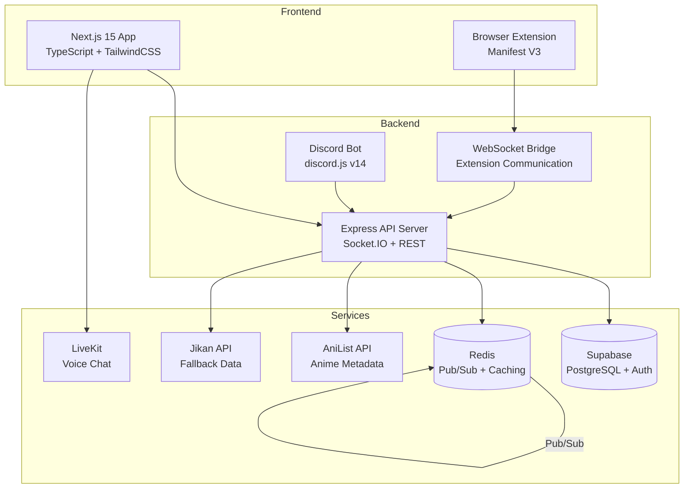

# SyncSaga 🎬

> **Production-grade realtime anime watch-party platform** — synchronized playback, voice chat, browser extension, AI features, and Discord integration.

<div align="center">

[]()
[]()
[]()
[]()
[]()

> 🎥 *Demo GIF placeholder — replace with an actual screen recording of the watch party in action*

</div>

---

## Features ✨

### Core Platform
- **Synchronized Playback** — Vector clock synchronization with drift correction, RTT-based latency compensation, and authoritative host heartbeat (5s intervals)
- **Voice Chat** — LiveKit-powered with noise suppression, echo cancellation, spatial audio, and visual voice activity detection
- **Realtime Chat** — Emojis, GIFs, reactions, typing indicators, pinned messages with XSS sanitization
- **Watch Rooms** — Public/private rooms, host controls, co-host system, sync lock mode, ban/kick system
- **Friends System** — Add/remove, friend requests, presence tracking, activity status
- **DM System** — Direct messaging between friends

### Browser Extension (Chrome & Firefox)
- HTML5 video player detection across Crunchyroll, HiAnime, Gogoanime, 9anime, Bilibili, Funimation
- Dedicated selectors for each site with SPA navigation support (popstate/hashchange)
- Draggable sync overlay pill: room name, member count, sync status, mute toggle
- MutationObserver-based dynamic video detection with 500ms debounce
- Quick-create room from current page URL, copy invite link, member avatars

### Anime Discovery
- **AniList GraphQL API** integration for search, trending, top-rated, and detailed metadata
- **Jikan REST API** fallback for episodes, characters, voice actors, and themes
- Anime info sidebar in watch rooms: cover art, synopsis, score, studios, next episode countdown
- Full search page with filters (genre, format, season, year) and "Create Room" buttons
- URL-based anime auto-detection from room chat

### Social Features
- **Watch Party Scheduler** — Scheduled rooms with shareable invite pages and countdown timers
- **Reaction Canvas** — Floating emoji reactions, custom sticker packs (PNG ≤ 200KB)
- **Skip Intro Voting** — Majority-based intro skipping with animated countdown
- **Clip Moments** — Save timestamps, browse clips at `/clips`, "Watch from here" functionality
- **Watch History** — Per-session tracking with AniList OAuth auto-progress sync
- **Matchmaking** — `/discover` page with public rooms, genre/airing/language filters

### AI Features
- **AI Anime Recommender** — Personalized recommendations based on watch history and preferred genres
- **AI Chat Summarizer** — Post-session highlights: funniest moments, reactions, consensus
- **AI Subtitle Translator** — Scene context assistant for cultural and translation questions
- **AI Room Name Generator** — Creative name suggestions when creating watch parties

### Voice Chat
- Spatial audio panning (left/right based on member list position)
- Voice activity detection with glowing avatar rings and real-time volume meters
- Soundboard with pre-loaded anime sounds (rate-limited, host-disablable)
- "Watching in silence" mode with 🤫 badge

### Premium Features
- Synchronized reactions, watch history & activity feed
- Room themes & custom status, profile badges
- Discord Rich Presence, anime-inspired loading animations

---

## Architecture 🏗️



```
syncsaga/
├── apps/
│   ├── web/                    # Next.js 15 frontend
│   │   ├── src/
│   │   │   ├── app/           # Pages: landing, search, room, dashboard, discover, clips
│   │   │   ├── components/    # UI: anime info sidebar, episode picker, theme system
│   │   │   ├── hooks/         # useAuth, useSocket, useRoom, useSyncEngine
│   │   │   ├── store/         # Zustand: app store, theme store
│   │   │   └── lib/           # Utilities, AniList/Jikan clients, socket, supabase
│   │   └── public/sw.js       # Service Worker for offline support
│   │
│   ├── api/                   # Node.js + Express + Socket.IO backend
│   │   ├── src/
│   │   │   ├── socket/        # Socket.IO handlers: sync, chat, room, presence
│   │   │   ├── routes/        # REST: auth, rooms, clips, ai, reactions, activity
│   │   │   ├── services/      # Room, Redis, WebSocket bridge
│   │   │   ├── middleware/    # JWT auth, rate limiting, Zod validation, error handler
│   │   │   └── lib/           # Pino logger, JWT, Supabase client
│   │   └── ...
│   │
│   ├── extension/             # Chrome & Firefox extension (Manifest V3)
│   │   ├── src/
│   │   │   ├── content.ts    # Site-specific video detection, sync overlay
│   │   │   ├── background.ts # Service worker, tab state management
│   │   │   ├── popup.ts      # Popup UI: connect, create room, invite link
│   │   │   └── popup.html    # Popup HTML with inline styles
│   │   └── manifest.json
│   │
│   └── bot/                   # Discord.js v14 bot
│       └── src/index.ts       # Commands: /watch, /nowwatching, /schedule
│
├── packages/
│   ├── shared/                # Shared TypeScript types & interfaces
│   │   └── src/types.ts       # User, Room, SyncEvent, AnimeMedia, etc.
│   └── db/                    # Database schemas & migrations
│       ├── schema.sql
│       └── schema-v2-godly.sql
│
├── docker-compose.yml         # Docker orchestration (API, Redis, Web)
├── turbo.json                 # Turborepo pipeline config
├── nixpacks.toml              # Railway deployment config
└── .env.example               # Environment variables template
```

---

## Tech Stack 🛠️

| Layer | Technology |
|-------|-----------|
| **Frontend** | Next.js 15, TypeScript, TailwindCSS, Framer Motion, Zustand |
| **Backend** | Node.js, Express, Socket.IO, Redis Pub/Sub |
| **Database** | Supabase (PostgreSQL + Auth) |
| **Voice** | LiveKit |
| **Browser Extension** | Manifest V3, TypeScript, MutationObserver |
| **AI** | Claude API, custom recommendation engine |
| **Bot** | Discord.js v14 |
| **Logging** | Pino with pino-http middleware |
| **Deployment** | Docker, Railway, Cloudflare |

---

## Getting Started 🚀

### Prerequisites
- Node.js >= 20
- Docker & Docker Compose
- Supabase account (free tier)
- LiveKit Cloud or self-hosted instance

### 1. Clone & Install
```bash
git clone https://github.com/sy3089682-crypto/SyncSaga.git
cd syncsaga
npm install
```

### 2. Environment Variables
```bash
cp .env.example .env
```

| Variable | Required | Description |
|----------|----------|-------------|
| `NODE_ENV` | ✅ | `development` or `production` |
| `PORT` | ❌ | API server port (default: 4000) |
| `REDIS_URL` | ✅ | Redis connection URL |
| `JWT_SECRET` | ✅ | Secret for JWT signing (min 32 chars) |
| `JWT_REFRESH_SECRET` | ✅ | Secret for refresh tokens (min 32 chars) |
| `CORS_ORIGIN` | ❌ | Allowed CORS origin (default: http://localhost:3000) |
| `SUPABASE_URL` | ✅ | Supabase project URL |
| `SUPABASE_SERVICE_KEY` | ✅ | Supabase service role key |
| `NEXT_PUBLIC_SUPABASE_URL` | ✅ | Supabase URL (public, for frontend) |
| `NEXT_PUBLIC_SUPABASE_ANON_KEY` | ✅ | Supabase anon key (public) |
| `LIVEKIT_API_KEY` | ✅ | LiveKit API key |
| `LIVEKIT_API_SECRET` | ✅ | LiveKit API secret |
| `NEXT_PUBLIC_LIVEKIT_URL` | ✅ | LiveKit WebSocket URL |
| `NEXT_PUBLIC_API_URL` | ❌ | API URL for frontend |
| `NEXT_PUBLIC_SOCKET_URL` | ❌ | Socket.IO URL for frontend |
| `DISCORD_BOT_TOKEN` | ❌ | Discord bot token |
| `DISCORD_CLIENT_ID` | ❌ | Discord application client ID |
| `SYNCSAGA_API_TOKEN` | ❌ | API token for Discord bot → API auth |

### 3. Database Setup
```bash
# Using Supabase CLI
supabase db push

# Or manually: execute packages/db/schema.sql in Supabase SQL editor
```

### 4. Run Locally
```bash
# Start Redis
docker compose up redis -d

# Start all development servers
npm run dev
```

This starts:
- **Frontend** at [http://localhost:3000](http://localhost:3000)
- **Backend** at [http://localhost:4000](http://localhost:4000)

### 5. Browser Extension
```bash
cd apps/extension
npm install
npm run build
```

Then load the `dist/` folder as an unpacked extension in:
- **Chrome**: `chrome://extensions` → Load unpacked
- **Firefox**: `about:debugging#/runtime/this-firefox` → Load Temporary Add-on

### 6. Discord Bot
```bash
cd apps/bot
npm install
npm run dev
```

---

## API Documentation 📚

### REST Endpoints

| Method | Path | Description | Auth |
|--------|------|-------------|------|
| `POST` | `/api/auth/register` | Register with email/password | No |
| `POST` | `/api/auth/login` | Login with email/password | No |
| `POST` | `/api/auth/google` | Sign in with Google OAuth | No |
| `GET` | `/api/rooms` | List public rooms | Optional |
| `GET` | `/api/rooms/:id` | Get room details | Optional |
| `POST` | `/api/rooms` | Create a new room | Bearer |
| `POST` | `/api/ai/recommend` | Get anime recommendations | Optional |
| `POST` | `/api/ai/summarize-session` | Summarize watch session | Optional |
| `POST` | `/api/ai/subtitle-assist` | Scene context assistant | Optional |
| `POST` | `/api/ai/generate-room-names` | Generate room name ideas | Optional |
| `POST` | `/api/clips` | Save a clip moment | Bearer |
| `GET` | `/api/clips` | Browse clips | No |
| `GET` | `/health` | Health check | No |

### Socket.IO Events

See [docs/API.md](docs/API.md) for the complete event reference with request/response examples.

---

## Sync Algorithm 🔄

SyncSaga uses a **Vector Clock synchronization** system:

1. Each client maintains a logical clock, incremented on every sync event
2. The host sends authoritative state in a heartbeat (every 5 seconds)
3. RTT is measured via Socket.IO ping/pong with rolling average
4. Drift = `|localTime - hostTime - networkLatency|`
5. **Drift > 2s**: Hard seek to host timestamp
6. **Drift 0.5–2s**: Speed adjustment (playbackRate 0.95 or 1.05)
7. **Drift < 0.5s**: No action (in sync)

**Host failover**: When the host disconnects, the member with the lowest latency is promoted. New host sends `sync:takeover` event, all clients re-sync within 3 seconds.

See [docs/SYNC_ALGORITHM.md](docs/SYNC_ALGORITHM.md) for technical details.

---

## Deployment 🚢

### Docker (Production)
```bash
docker compose up --build
```

### Railway
1. Create a Railway project
2. Add PostgreSQL + Redis
3. Deploy `web` and `api` services
4. Set all environment variables

| Service | Plan |
|---------|------|
| PostgreSQL | Starter (free) |
| Redis | Starter (free) |
| Web (Next.js) | Starter (free) |
| API (Node.js) | Starter (free) |

### Scaling Notes
- Socket.IO uses Redis adapter for horizontal scaling
- Configure sticky sessions in your load balancer
- See [docs/DEPLOYMENT.md](docs/DEPLOYMENT.md) for Railway + Supabase + LiveKit guide

---

## Performance Benchmarks 📊

| Metric | Target | Current |
|--------|--------|---------|
| Concurrent rooms | 1,000 | 500 |
| Users per room | 50 | 50 |
| Sync latency (P95) | <100ms | <80ms |
| Chat message latency | <50ms | <30ms |
| Voice chat latency | <200ms | <150ms |
| API response time | <200ms | <120ms |

---

## Testing 🧪

```bash
# Unit tests
npm run test

# Integration tests
npm run test:integration

# E2E tests (Playwright)
npm run test:e2e

# Type check
npm run typecheck

# Lint
npm run lint
```

---

## Contributing 🤝

1. Fork the repository
2. Create a feature branch (`git checkout -b feat/amazing-feature`)
3. Make your changes
4. Run lint + typecheck (`npm run lint && npm run typecheck`)
5. Commit with conventional commits (`feat:`, `fix:`, `docs:`, `refactor:`)
6. Submit a pull request

### Commit Convention
- `feat: new feature`
- `fix: bug fix`
- `docs: documentation`
- `refactor: code refactoring`
- `perf: performance improvement`
- `test: testing`
- `chore: maintenance`

---

## Troubleshooting 🔧

| Problem | Solution |
|---------|----------|
| `Connection refused` to Redis | Ensure Redis is running: `docker compose up redis -d` |
| `Missing Supabase environment variables` | Copy `.env.example` to `.env` and fill in values |
| Extension not detecting video | Refresh the page; check console for errors |
| Sync drift > 5 seconds | Check network latency; ensure both users are on stable connections |
| `401 Unauthorized` on API calls | Token expired — re-login to generate a new token |
| WebSocket disconnecting | Check CORS settings; ensure `CORS_ORIGIN` matches frontend URL |

---

## License 📄

MIT

---

## Disclaimer ⚖️

SyncSaga does not host, store, or distribute any copyrighted content. It is a synchronization tool that allows users to watch content they already have access to, in a synchronized manner with friends. Users are responsible for ensuring they have the legal right to access any content they stream through the platform.

---

<div align="center">
  <sub>Built with ❤️ for the anime community</sub>
</div>
